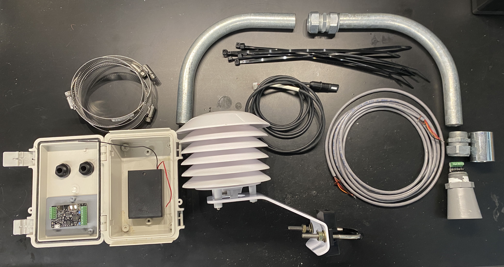
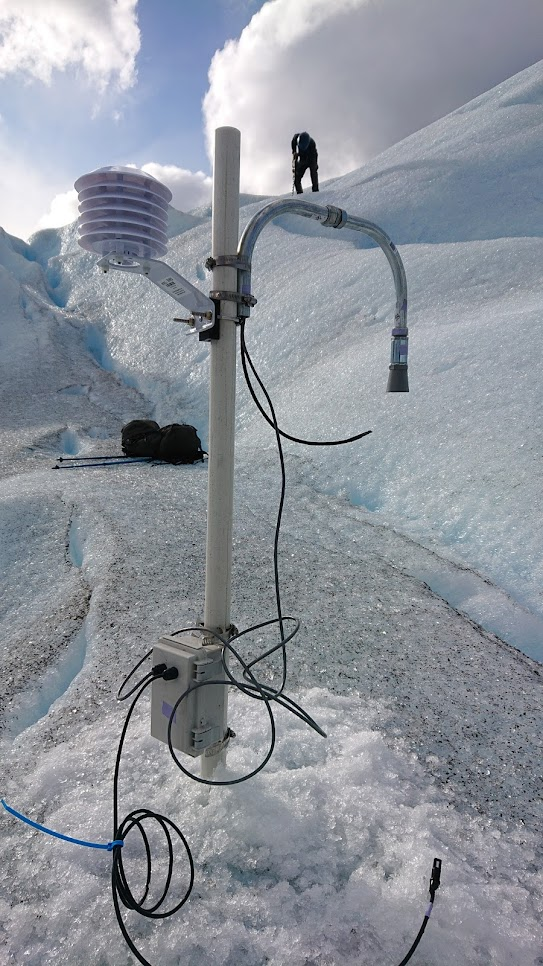
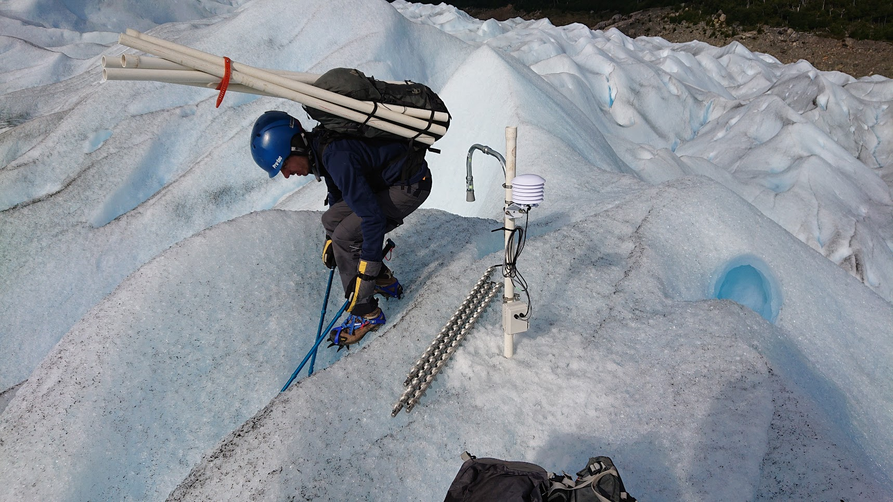
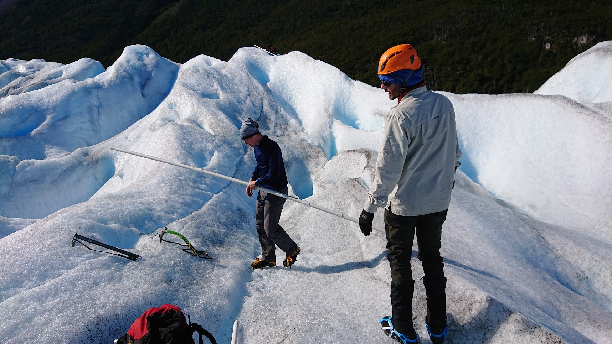

# How to build an automated ablation stake

## Reference

### This manual

Please cite this when referring to this guide in particular.

**Wickert, A. D.
(2023)
*How to build an automated ablation stake*
[Manual].**

### The associated article

Please cite this whenever using or referring to these ablation stakes:

**Wickert, A. D., K. R. Barnhart, W. H. Armstrong M. Romero, B. Schulz C. T. Sandell, S. B.
Penprase, M. Van Wyk de Vries, G. H. C. Ng, J. La Frenierre, and K. R. MacGregor
(in revision, 2023),
*Open-source Automated Ablation Stakes to Constrain Temperature-index Melt Models*,
Annals of Glaciology.**

## Materials


*Photo: Wickert et al. (2023), Annals of Glaciology, in revision. Photo credit: Shanti Penprase.*

Approximately clockwise from bottom left:
* Enclosure with cable glands, battery holder, and [Margay data logger](https://github.com/NorthernWidget/Project-Margay/)
* Hose clamps (4)
* 90-degree bends of 3/4" EMT conduit (x2)
* Conduit compression connector
* Cable ties (black for UV resistance)
* Conduit compression adapter (pictured inverted from attachment direction)
* 3/4" NPSM straight connector
* MaxBotix ultrasonic rangefinder (here we assume that it will communicate with the data logger via its UART interface)
* [MaxBotix Helper](https://github.com/NorthernWidget/MaxBotix-Helper) (Optional but useful), including:
  * 1 1x6 screw terminal block, 0.1" spacing
  * 1 1x7 stubby male header
* 4-conductor cable (3-conductor also works, but is not as often sold)
* Telaire T9602 temperature and relative-humidity sensor
* Solar radiation shield
* Not pictured:
  * MaxBotix MaxTemp temperature correction
  * Mounting gasket and nut for the ultrasonic rangefinder
  * Pole for main mast and/or support: Use one or more thick (e.g., Schedule-80) pieces of plastic pipe or other rigid material as the main mast and/or supporting structure. A single main mast may spin, so additional support is recommended. 

*Detailed parts list with suppliers is available in the cited paper*

## Rangefinder

### MaxBotix Helper and Cabling

* Solder the 1x6 screw terminal and 1x7 header to the MaxBotix Helper.
* Solder the MaxBotix Helper to the MaxBotix ultrasonic rangefinder.
* Using the screw terminal, secure three wires of the 4-conductor cable to the "logger" side of the MaxBotix Helper.
* Using the screw terminal, secure the appropriate three wires of the MaxTemp temperature currection to the MaxBotix Helper.

### Attachment to physical structure

* Optionally, attach the nut (first) and then the gasket to the ultrasonic rangefinder. Alternatively, you may create a seal using Teflon tape.
* Thread the NPSM straight connector around the wires, and screw it onto the ultrasonic rangefinder.
* If applicable, tighten the nut to seal the gasket around the rangefinder.
* Thread the conduit compression coupling around the cables, and screw it into the NPSM straight connector.
* Thread both cables through one of the 90-degree conduit elbows.
* Tighten the conduit compression adapter around the end of this elbow, securing the rangefinder to it.
* Attach the conduit compression connector to the other end of the elbow, around the cables.
* Thread both cables through the second 90-degree conduit elbow.
* Attach this elbow to the rest of the assembly using the other side of the compression connector.

## Temperature and relative-humidity sensor (T9602)

* Clip the header off of the end of the cable.
* Strip and tin the wires

## Data logger

### Logger setup

Follow the instructions at https://northernwidget.com/tutorial/ to set up the data logger; do not forget the SD card or the coin-cell battery for the clock.

### Enclosure

* Obtain a waterproof enclosure and two cable glands.
* Drill and clean the enclosure and attach the cable glands.
* Mount the data logger and its battery pack into the enclosure.
* When finished with all steps, ideally place desiccant packs into the enclosure and close it to seal it, ensuring that the cable glands are also sealed.

### Wiring

* Wire the battery pack (in OFF position) to the data logger.
* Thread the T9602 cable through one cable gland, and attach it into the screw terminals for the I2C interface as indicated here: https://github.com/NorthernWidget/T9602_Library
* Tighten this cable gland when ready.
* Thread the MaxBotix ultrasonic rangefinder 4-conductor cable through the other cable gland.
* Connect as follows from the MaxBotix Helper to the Margay data logger on the same side as that to which the T9602 is attached:
  * GND to GND
  * V+ to 3V3
  * SIG to Rx
* Tighten this cable gland when ready.

### Code

This *untested* code is based off of what was used for the Perito Moreno deployments: https://github.com/MNiMORPH/Perito-Moreno-ablation-stakes.

All required firmware libraries are aggregated here: https://github.com/NorthernWidget/NorthernWidget-libraries, and should be already installed via the step to follow the tutorial.

```c++
#include "Margay.h"
#include <Maxbotix.h>
#include <T9602.h>

Margay Logger;
Maxbotix Range; // Hard-coded for RX1
T9602 TRH; //Initialize T9602 Humidity sensor

String header = ""; //Information header

//0x28: T9602 (T, RH)
uint8_t I2CVals[] = {0x28};
unsigned long updateRate = 300; //Number of seconds between readings 

void setup() {
        header = TRH.getHeader() + \
                 Range.getHeader();
                 
        Logger.begin(I2CVals, sizeof(I2CVals), header); // Pass header info 
                                                        // to logger
        init();
}

void loop() {
        init(); //Ensure devices are intialized after power cycle 
        Logger.Run(update, updateRate);
}

String update() {
        return TRH.GetString() + Range.GetString();
}

void init()
{
        Range.begin();
        TRH.begin();
}
```

## Solar-radiation shield

Secure the MaxTemp sensor and T9602 within the solar radiation shield. *Note that you may want to do this after arriving in the field to make transport easier.*

## Main mast assembly

*Depending on logistics, consider which components of this work should be performed before or after going to the field.*

* Prepare one piece of straight rigid material, or ideally, a structure including a main mast and support pieces to prevent tilting or rotation.
* Using two hose clamps, attach the ultrasonic rangefinder inverted-U assembly to the main mast.
* Using the other two hose clamps (or another fastening method of your choice), attach the waterproof data-logger enclosure to the main mast.
* Above the ultrasonic rangefinder, attach the solar-radiation shield to the main mast.
* Ensure that cables are not tangled or wrapped inconveniently.
* Check that the system is working.
* Secure cables with cable ties.

## Borehole and installation

* Use Kovacs ice augers to drill one or more ~5 cm holes in the glacier surface to an appropriate depth for your ablation-station mast and any supporting structure(s).
* Place the ablation stake into the hole(s).
* Seat and secure any remaining sensors.
* Photograph the stake.
* Record its location, as well as the date and time.
* Turn on the data logger and check that it is recording.
* Wish it good fortune and walk away.

## Photos

### Partial installation



*Single-mast (not recommended) ablation stake installed in Glaciar Perito Moreno, Argentina; February, 2020. Temperature and relative-humidity sensors have not yet been placed inside the solar-radiation shield. Photo: Andy Wickert. Pictured: Guillermo Tamburini Beliveau.*

### Completed installation



*Fully installed ablation stake. Photo: Andy Wickert. Pictured: Guillermo Tamburini Beliveau. Guillermo is carrying sections of plastic pipe that we cut apart for transport and then reconnected in the field. Kovacs ice augers lie next to the installed station.*

### Removal



*Max van Wyk de Vries carries the main mast of the ablation stake for retrieval while Mati Romero looks on. The sensor package is already packed in a backpack. Photo: Andy Wickert.*
